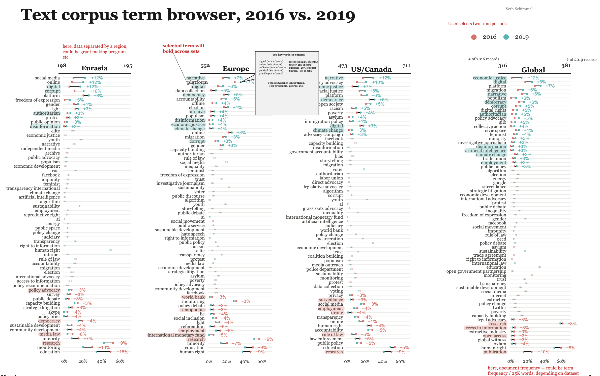
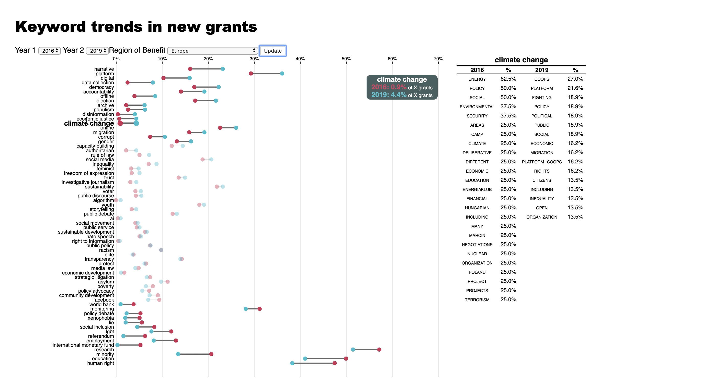
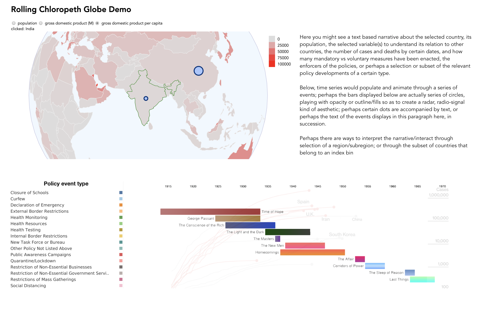
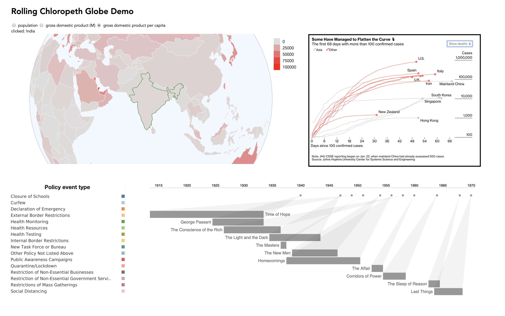
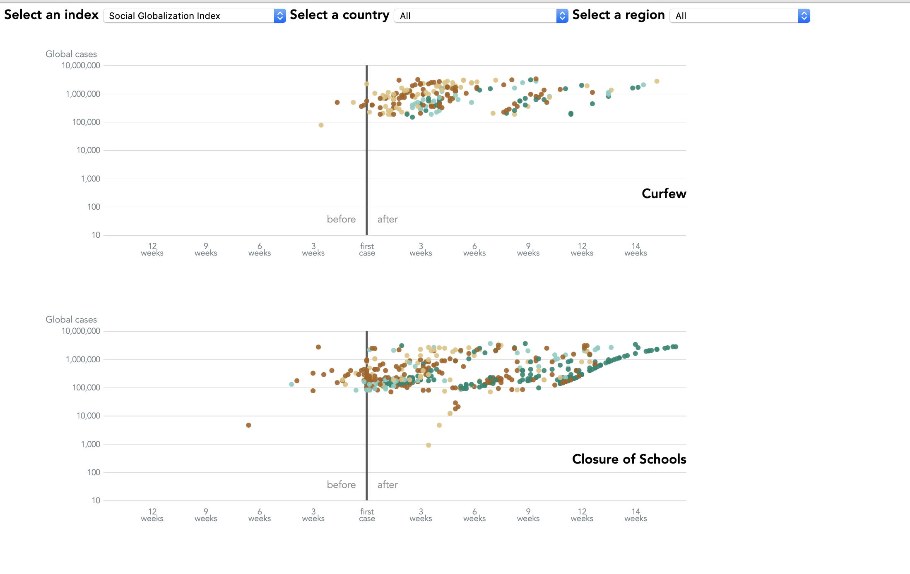
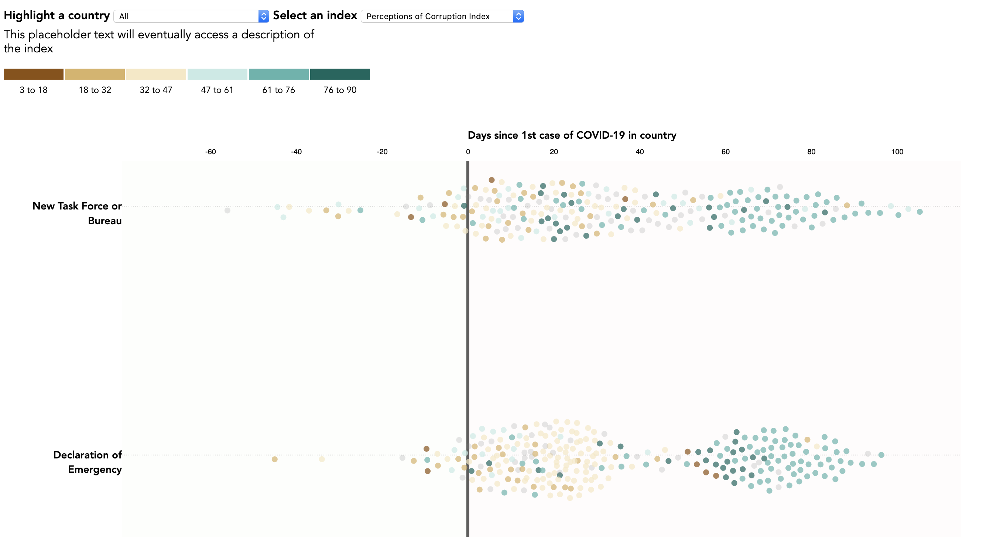
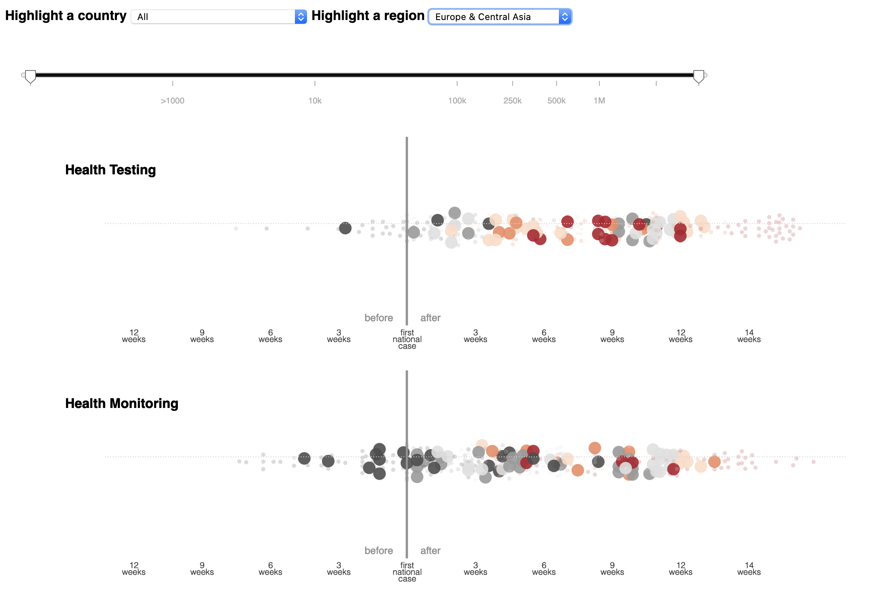

# 2020 Interactive Viz Final Portfolio
 2020 Interactive Viz Final Portfolio

[Exploratory Project](#exploratory-project)

[Narrative Project](#narrative-project)

[Reflection](#reflection)

## Exploratory Project

#### Abstract: 

For my exploratory project, I aimed to create a browser that could facilitate qualitative analysis and scoping of data for collections of grant records such as those available from the National Science Foundation, Candid/the Foundation Center, or other public or private foundations.  Grant records are an interesting source of data allowing us to examine funding flows to specific types of ideas or projects being carried out by non-profits and NGOs.  Since these records do not always have fine grained structured metadata, it can be useful to use NLP tools to use the unstructured text associated with records to examine the content.

The project was centered around a dataset of keyword document frequencies by year and regions (e.g. % of records with 1+ mention of a given keyword), as well as a dataset with keyword collocations for a curated set of target keywords.  The latter portion provides a window into the contexts that target keywords appear in, and was also generated by year and region to add detail to the main dataset. Finally, a small dot plot provides users with a sense of the cross-regional distributions in keyword usage so that they can see roughly how much a kewyord was used in the selected region compared to the others. 

The main plot is a cleveland dot plot, configured to show % changes in document frequency between two selected years.  The aim is to facilitate trend analysis and allow a user to select a window of time and region to examine; this would serve as an exploratory dashboard so that a user can explore the dataset from afar before jumping in to undertake careful reading and qualitative analysis.

#### [Deployed path] (https://sethsch.github.io/Interactive-Data-Vis-Sp2020/exploratory_project/)

### [Project Files] (https://github.com/sethsch/Interactive-Data-Vis-Sp2020/tree/master/exploratory_project)

#### Artifacts of the design process: 

#### Media from the project:

A video walkthrough of an early version posted to the class Slack for critiques is [available here](https://drive.google.com/open?id=1f192v8xOzLxR44n-W73qqlXLX9KQ4R70), while a video walkthrough of the final version and explaining some of the data/functionality limitations is [available here](https://drive.google.com/open?id=1uYouMF1gw-aGw2mugchEYRxKRhDUa9fF).

#### Data: 

The code for generating the data was developed using private datasets as well as public datasets of grant records such as the National Science Foundation's. The deployed path shows a version with randomized keywords, while the attached video provides a run through of what the dashboard would look like with qualitatively meaningful data.

## Narrative Project

#### Abstract: 

This project was inspired both by a desire to get away from linguistic data analysis and current events related to the pandemic. Many datasets are being collected in real time that record government policies and orders.  As the virus spreads globally, different timelines are playing out in different countries and I began to wonder how might be an effective way to visualize 'polytemporal' phenemonon such as this without using an absolute calendar date... 

Using the CoronaNet Reserach Project's "Tracking government responses towards COVID-19" dataset, I created beeswarm plots that display swarms of activity for a given type of policy.  Instead of displaying by calendar date, I computed the relative date of each policy with respect to the first confirmed case of covid-19 in that country.  To examine the policies that were announced at a given time and see which were announced proactively and which were announced reactively, users can use a slider to hone in on a period of the pandemic by the scale of the outbreak and then use dropdowns to select specific countries or regions.

#### [Deployed path] (https://sethsch.github.io/Interactive-Data-Vis-Sp2020/narrative_finalPost/blog-post.html)

#### [Final project files] (https://github.com/sethsch/Interactive-Data-Vis-Sp2020/tree/master/narrative_finalPost)

#### Media from the project:
A video walkthrough of the final project can be [found here.](https://drive.google.com/open?id=1H1iVD-aQcnBaLwnUwO1e35AruEWPy555)

#### Data: 

The data was obtained from [CoronaNet Research Project](https://coronanet-project.org/)'s website, where it is being updated several times a week.  I then used python to reformat the data in several ways, based upon earlier plans to feature geographic maps to visualize the data.  I formatted the data by country and date, and then policy, and added a field for the date that policies began relative to the first confirmed cases.  

#### Artifacts of the design process: 

The intitial prospectus, alongside sources of inspiration and reference can be [found here.](https://github.com/sethsch/Interactive-Data-Vis-Sp2020/tree/master/narrative%20project_devFiles) 

The images above show my early thinking about what features to include, and highlight the period where I was grappling with how to display events happening in time even when different areas are / are not yet experiencing the local effects of the pandemic.

I then proceeded to explore the swarm plots and a scatter plot with a logarithmic axis. 

 I ultimately decided to translate the logarithmic axis of the scatter plot into a slider, hoping that the interactivity of the slider would help foster understanding of the conceptual issues around policy signaling during the pandemic moreso than a static axis with (additional) cluttered dots to parse.

## Reflections

While completing these projects, I learned a lot about pacing myself through parts of each project and spacing out my sense of concern with certain details as I go.  Breaking down the project and my ideas into smaller parts gave me more reasonable portions of coding to feel I could accomplish before taking a break and re-fueling.  I sometimes found myself concerned with "final-detail" kinds of considerations too early on in the process -- like choices of color, font etc. -- and ultimately found that my choices on design were to be limited by time and what I could make happen functionally in the code.  This reflection will help me as I go back through our course notes and think about how to better integrate conscientious planning into my design process on future projects.  I followed the suggested design process most closely in the exploratory project, with the key advantage being that I'd already designed a static version of the project for other purposes before starting the interactive project for class.  On the narrative project -- partially due to the immediacy of current events and the fact that data collection for that dataset is ongoing -- I struggled to completely comprehend my own interests in the dataset, the significance of what ultimately became my interests, and the ways I could use the data to communicate those interests.  As a result, the design process was more fluid and less structured.  This led to at least one session of roundabout, debatably unproductive coding... but ultimately, I was happy with what I achieved and learned along the way.

During the critique sessions, the most helpful moments were opportunities to see what features stood out to my peers and think about why those features were most salient to them and how I could integrate it into my design.  For instance, for my narrative project I initially made a bee swarm plot and a scatter plot with a log-scale y-axis.  The latter seemed to be more effective in expressing my interests in thinking about global and local signals, and proactive and reactive policy responses. However, instead of using that plot to make a point and jump to another, I figured out how to integrate the only difference between the two plots (its Y axis) into a slider for the swarm plot.  This allowed me to create a swarm plot that is simpler in its display (one axis, reflective relative time scales) and has features that encourage interaction instead of soliciting visual interpretation of a static encoding scheme.   I’m not sure that the final product is fully successful in communicating my ideas, but at the very least I feel excited about the possibility of re-creating this concept for other projects: non-temporal sliding scales applied to temporal data.

If I had more time and resources, I would try to create neater file structures and collect my notes and files more cleanly.  I would also take time to reflect on how early iterations of processed data do or do not make my life easier.  For instance, inspired by a package called “Rolling Globe” — which included its own integrated geo-json — I reformatted the CoronaNet data thinking it’d eventually get joined into the default geo-json.  I learned a lot about reformatting data into JSON (which I feel happy about; I’m very partial to JSON now and I wasn’t before), but ultimately made my code more complex and had to write functions to then unpack the data from the json format, and filter it.  I ended up getting to a certain point in the code where I was relying on these ad-hoc solutions so much so that I was afraid to go back through and think more soberly about what data processing decisions would’ve been best.  I also realize that my code is poorly notated as it stand (sorry!).  In the future I want to proceed more carefully and deliberately and set myself up to be able to use and reuse portions of the scripts.  In many cases, this is why I’ve left lines in my code and have commented them out.  This is also why after writing both my log-scale scatter plot and also my bee swarm plot for the narrative project as stand-alone scripts, I re-wrote them as modules.  I wholly appreciate the utility of writing charts as modules and editing to add functionality as needed.  It’d be great to have my own library of charts with functionality available as needed to be implemented for specific projects and datasets.  Unfortunately, I didn’t have time to re-write my exploratory project as a collection of modules —- and the long file of code for this project could benefit from being broken up into simpler parts more cleanly.

If I had additional time, I’d also like to learn how to pass a set of states to my graphs for use in narrative visualization.  I was close to figuring it out, but not close enough and had to resort to writing text instructing the user what to look for (which is less than ideal).  For the exploratory project, I used a secondary circle-based plot with the notion that the circles would support constancy, while ultimately I think a more numerically transparent stacked bar graph would work better there.  I could still achieve constancy through coloration and yield a more informative use of screen space by doing so, I think.   

All in all, I’m very pleased with the degree to which I was able to learn D3 through this course.  I’m inspired to learn more about design principles, HTML and CSS this summer so that I can more fully realize ideas for visualizations.